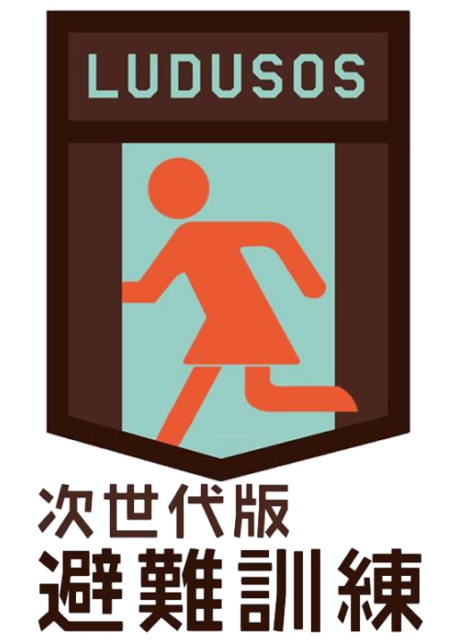

# LUDUSOS
次世代版避難訓練LUDUSOS オープンソースリポジトリ

※ 本リポジトリ作成は、[青山学院大学古橋研究室](https://medium.com/furuhashilab)１期生[中井美沙の卒業研究](https://docs.google.com/document/d/1OmcSSBiv6LqP4BSLjG4_wl4cIazg5qukpauKfAyAdEQ/edit?fbclid=IwAR3O0lpKk7JfuOU8CF8omHc5f-H7CJ_ux1zv-v3diwnl8pFFShnmw8QwTNs#)の一環として実施した。

© [一般社団法人防災ガール, CC BY-SA 4.0](https://creativecommons.org/licenses/by/4.0/deed.ja) , © [Bosai Girl, CC BY-SA 4.0](https://creativecommons.org/licenses/by/4.0/deed.ja)

https://github.com/bosai-girl/LUDUSOS/blob/master/LICENSE.md

## 目次

1. はじめに
2. 次世代版避難訓練とは
3. 実施原則と留意点
4. プログラムの流れ
5. これまでに実施した次世代版避難訓練
6. おわりに
7. 参考資料一覧

## 1.はじめに
　災害大国と言われる日本。しかし、１若者の4分の3は防災対策をおろそかにしているという現状がある。これから起こるであろう災害に向けて、実践的かつ若者が進んで参加したくなるような避難訓練を開発することで、災害が起きた際の人々の命を救う一助としたい。そんな思いを持つ一般社団法人防災ガールは、次世代に必要な避難訓練を開発した。一般社団法人防災ガールが提唱するこの避難訓練は、従来の受動的な避難訓練とは違い、参加者が主体的に行動することが求められる。次世代版避難訓練と名付けられたこの避難訓練は、ゲーミフィケーションを導入するとともに避難訓練を実施する地域に合わせてさまざまなツールと連携して実施される。
　本稿はこの次世代版避難訓練について紹介するとともに、これをオープンソース化することを目的としている。本稿の構成は以下の通りである。第2章では、次世代版避難訓練について説明するとともに、それが生まれた背景、従来の避難訓練との違いについて解説していく。また、類似した避難訓練について言及する。第3章では、次世代版避難訓練の実施原則と留意点について解説する。第4章では、連携ツールを紹介するとともに、プログラムの流れについて説明する。第5章では、過去に実施された次世代版避難訓練について紹介する。第6章では、結論を述べる。
　尚、この次世代型避難訓練のライセンスは CC BY-SA 4.0とし、「© 一般社団法人防災ガール, CC BY-SA 4.0」もしくは「© Bosai Girl, CC BY-SA 4.0」という表記を用いることとする。

## 2.次世代版避難訓練
　次世代版避難訓練は、「自ら考え、決断し、行動する」という人を育てるための思考訓練を兼ねた避難訓練である。

### 次世代避難訓練が生まれた背景
　日本は、他国に比べて気候・地形・造山運動等の地理的条件によって台風、大雨、洪水、土砂災害、地震、津波、火山噴火などの自然災害が発生しやすい国である。２日本の国土面積は全世界の0.28%であるのに対し、全世界で起こったマグニチュード6以上の地震のうち20.5%は日本で発生し、全世界の活火山のうち7.0%が日本に存在する。また、全世界で災害によって死亡する人の0.3%が日本人であり、全世界の災害で受けた被害金額の11.9%が日本のものである。このように、日本は世界でも災害の発生する割合が高い国となっている。

　そうした事例を踏まえ国や自治体が国民を対象に防災訓練・避難訓練を実施してきたにも関わらず、若者の3分の2は防災訓練に参加したことがないという統計結果が明らかになっている。

### 従来の避難訓練との違い
　従来の避難訓練は、避難経路と避難先が定められており、参加者は引率者の指示によってのみ動くという受動的な仕組みになっている。
　次世代版避難訓練は、従来のものとは違い、避難経路も避難先も定められておらず、引率者も設定されていない。また、ゲーミフィケーション要素を加えることで、参加者に訓練への能動的な参加を促す仕組みになっている。
　このような新しい避難訓練はいくつか登場している。具体的には、「すごい災害訓練」「防災トランプ」「ツママレプロジェクト『キツネを探せ』」が挙げられる。

### 新しい避難訓練
　先述した新しい避難訓練について概要を記していく。まず、「すごい避難訓練」、次に「防災トランプ」、最後に「ツママレプロジェクト『キツネを探せ』」の順に言及する。

#### 「すごい避難訓練」
　今回は、2014年8月4日から5日にかけて浦安市「立志塾」と共同で行った３「すごい避難訓練」ついて簡単に記述する。浦安市、浦安市教育委員会が主催のこの避難訓練は、浦安市総合体育館及び運動公園で実施された。対象は、市内9つの公立中学校の2年生である。総勢27名が参加した。被災したという想定の浦安市内を、参加者はiPad片手に徒歩で回り、Twitterを介して状況を記録・報告しつつ、学んだ知識を実践するというプログラムである。震発生後、参加者は6グループに分かれて市内の避難所を目指すのだが、彼らにはミッションが課せられていた。ミッションの内容は、市内の指定された場所をチェックして状況報告としてTwitterに投稿することである。その際、ハッシュタグ「#DECO_URY」を使用して投稿すると、災害対策本部がそれをチェックするという仕組みになっている。これには、避難中に発見した災害の状況やけが人の様子などを共有するという目的がある。訓練の最後には、参加者がそれらの体験をiPadでムービーにまとめ、発表した。
　災害対策本部は防災無線を利用して市全体や地域ごとに情報や指示を伝達することは難しかった。しかし、Twitterを利用することでそれが極めて容易になる。そして、地域にいる人から現地の状況が寄せられることで、災害対策本部も被害の状況をいち早く把握できるメリットがあると、日経トレンディネットは報じた。今後、さらなるブラッシュアップが図られ、浦安市の先進的な取り組みが全国で実用化されることが期待されている。

#### 「防災トランプ」
　４「防災トランプ」とは、「通常のトランプルール」に「防災の話」をすると、有利なボーナスがもらえるルールが追加されたトランプである。

　追加ルールやボーナスはゲームごとに異なる。下図にその一例を示す。

　この防災トランプはその時の状況に応じて適切な行動がとれるようになる人づくりを目的に作成された。防災トランプを使用して遊ぶことで、自分のための防災訓練とは何かをひとりひとりが考え、防災について世代をこえて楽しく話し合うための場づくりの一助となることが期待されている。

#### ツママレプロジェクト「キツネをさがせ」
　今回は、2015年8月9日に行われた５「ツママレプロジェクト『キツネをさがせ』」について簡単に記していく。ツママレプロジェクトin陸前高田実行委員会が主催し、岩手県陸前高田市広田町の広田小学校周辺地域で行われたこのイベントには、地元広田町の小中高生・中央大学・法政大学・東北大学・北海道看護大学・明治大学の学生など約70名が参加した。このイベントは、防災とアートを織り交ぜた二段階構成のプログラムとなっている。ひとつは「キツネ」に扮したアーティスト・森脇環帆を追いながら避難経路を散策する体験型プロジェクト、もうひとつは、シールを使って避難経路の安全情報を加えたアーティスティックな安全マップを作成する創作型プログラムだ。いづれも、昨年広田町の住民有志が作成した津波からの「逃げ地図」を活用した点に加え、「キツネ」の面の眼球にウェアラブルカメラを装着し、タブレット端末に配信された目線映像を頼りに「キツネ」を探すという映像機器を駆使したプログラムという点が注目された。
　終了後のアンケートによると、参加者のほとんどがこのプログラムは子どもの安全や地域の理解に役立つと回答している。このような体験型プログラムは「理解しやすく、楽しめる、親しみやすい」「アートを用いることで興味をひき防災へとつなげることは良い」等の肯定的な意見が数多く寄せられた。その一方で、被災地における地元住民、特に子どもの参加が少なく、アーティスティックな安全マップは「おしゃれだけど字が小さいので万人受けではない」など、機能とアートのバランスが指摘された。

　このように新しい防災訓練については、様々な団体が考案・実行している。これらの試み中の次世代版避難訓練との類似点を挙げると、街歩き型であること・ipad等のテクノロジ連携ツールを使用していること・楽しく学ぶことのできる工夫がされていることである。防災トランプはこの中で唯一「まち歩き型」ではないが、低コストで場所を選ばず、手軽に楽しく防災を学べるという点で、防災訓練のひとつとして有用であることがわかる。

## 3.実施原則と留意点
### 実施原則
　次世代型避難訓練の実施原則は4つ設定されている。
１．実際に街を歩き、街を観察するフィールドワーク型であること
　この避難訓練をフィールドワーク型にするのは、実際にその場で災害が起きたときにどのような危険が潜んでいるのかということを参加者に考えさせるためである。また、実際に街に繰り出すことで、災害時にどんな行動をとるべきか、何に注意しなければならないかを現実に即して考えることができる。このように、フィールドワーク型にすることで、参加者の災害時の状況を想像する力を高め、緊急時の冷静な対応につなげる。
２．参加者を少人数のグループに分けること
　参加者を少人数のグループに分けるのは、参加者1人に対する裁量権を高め、企画への関与度を高めるためである。この避難訓練は、実際の災害が起きた状況を想像し、取るべき最適な行動を参加者自身が決断する思考訓練である。思考訓練を実施するためには、周囲の人と意見を交換しながらも自身の頭で考え、判断することができる環境を作り出す必要がある。そのため、全員が意見交換をしやすい少人数グループで行うことが望ましい。
３．訓練への制約
　訓練への制約は2つある。ひとつは、避難経路と避難場所を参加者自身に決めさせること。なぜ避難経路と避難場所を参加者自身に決めさせるのかというと、想定外の事態における判断力の獲得と習熟を促すためである。実際に災害が起きた場合、公的に定められた避難場所が本当に安全かどうかはわからない。そのため、この避難訓練では、あらかじめ決められた避難場所や避難経路を利用するのではなく、災害時の様々な起こりうる状況を考慮して、参加者自身にどのような経路をたどり、どのような場所に避難するのが適切かを考えさせる。
　もうひとつの制約は、時間の経過に伴い状況を変化させることである。状況を変化させる理由は、刻々と変化する災害時の状況を参加者に疑似体験させるためである。実際に災害が起きた場合、時の経過に伴い、二次災害が起きたり被災地域や被災状況に関する情報が氾濫したりすることが予測される。このとき、被災者は限られた時間で得られる情報をもとに、自身の行動を考えなければならない。そのような現実に起きうるハプニングや状況変化を訓練に付加することで、参加者が実際に被災したときの適切な判断の一助となり得る。
４．ゲーミフィケーションの付加
　６ゲーミフィケーションとは、遊びや競争など、人を楽しませて熱中させるゲームの要素や考え方を、ゲーム以外の分野でユーザーとのコミュニケーションに応用していこうという取り組みである。ゲーム独特の発想・仕組みによりユーザーを引き付けて、その行動を活性化させたり、適切な使い方を気づかせたりするための手法だ。本稿においてのゲーミフィケーションとは、人を楽しませて熱中させるゲーム要素という意味で用いる。
ゲーミフィケーションを訓練に取り入れる理由は、3つ挙げられる。
　まず、自発的な学びの促進に効果的なためである。課題(この場合、防災ミッション)を達成して得られる報酬やフィードバックが参加者の意欲を掻き立て、自発的な学びを促す。また、楽しみながら取り組める点も理由のひとつである。最後の理由としては、実践力が身につくことが挙げられる。ゲームを通じて被災状況を疑似体験することで、より実践的な知識・対処法を身に付けることができる。

### 留意点
　この防災訓練では、参加者自身が意欲的に訓練へ参加するという高い主体性が求められる。よって、参加者の主体性を高めるような設計が必要となる。その手法として、世界観の構設定・参加者間の仲間意識の構築が挙げられる
　世界観を生み出すためには、会場の装飾・チケット・パンフレット等のデザインを統一させる必要がある。また、参加者をよりその世界観に入り込ませるために、スタッフ側の備品は参加者側から見えないように会場設計を行い、裏側を見せないことに留意する必要がある。
　ゲーミフィケーションの導入もまた効果的である。参加者全員が高揚感を持って防災訓練に参加し、参加者の主体性を高める一助とする。
　仲間意識の構築については、参加者に視覚的要素を指定することが有効である。例えば、参加者に赤色のアイテムを身に付けるよう指示することによって、赤色のアイテムというその日限りの所属を意識させる共通アイテムを生み出す。共通アイテムが存在することで、参加者間に仲間意識が芽生える。
　また、仲間意識を構築する上でグループ編成にも留意点がある。それは、4~5人で1グループとすること・年齢や性別に偏りがないように編成することである。少人数にすることで主体性が高まり、参加者間でのコミュニケーションが円滑に行われる。同時に、年齢や性別に偏りがないようにグループ編成することで多様な視点を考慮したよりよい学びが得ることができる。
　情報記録の手法についても留意しておきたい点がある。それは、イベント中に動画撮影・写真撮影をすること・オンタイムの議事録を作成すること・イベント終了後の行動変化を調査することである。これらを通して、企画全体を通した情報のストック、また、災害時における個人・集団の行動予測データとしての活用が可能となる。
　最後に留意しておきたいのが、話題性の創出である。視覚的要素の徹底、自撮りスポットの設置によって、参加者がSNS上に防災訓練の情報を発信することを促す。参加者の口コミやSNSへの投稿によって発信された情報は、防災訓練の宣伝・記録に役立つ。

## 4.プログラムの流れ
　次世代型避難訓練は、「自ら考え、決断し、行動する」という人を育てるための思考訓練を兼ねた避難訓練である。このプログラムは避難訓練実施地域により適性のあるツールと連携して行うことができるため、どのような環境・要望にも柔軟性に対応することができる.

　上の図中にあるTOLAF、カードゲーム、テクノロジ連携の順にプログラムの流れについて説明する。

### 1.TOLAF
　TOLAFとは、Think Our Life and Futureの略で、防災ガール独自の用語である。LUDUSOSとして選択可能な訓練手法の一つで、大きな特徴は特別な道具やITツールを必要としない街歩き型の体験型訓練手法である。予測されている南海トラフをはじめとする様々な災害に関し、自分たちの生活や未来、大切な人のことを考えて行動するという意味が込められている。この避難訓練は、事前情報なく、携帯電話も使用せず、チームで協力し、同行スタッフの問いかけのもと、制限時間内にたどり着ける最も安全な場所を見つけ出す街歩き型訓練である。訓練の流れは以下の通りである。
#### 流れ
１．集合
２．ルール説明
３．チーム別街歩き
４．フィードバック

#### ルール

* ４~５人で１チームとなり制限時間以内に避難する
* 制限時間以内に安全な経路を選択し、安全な場所まで避難する。
* 参加者は注意・予測・行動を自ら考える。
* 訓練終了後は個々の考えを共有する。

### 2.カードゲーム
　LUDUSOSのひとつとしてカードゲームが検討された。しかし、現時点で実装可能段階にまで至っていない。一般社団法人防災ガール代表田中美咲氏によると、アイデア次第でカードタイプへの応用も可能であると考え考案したに留まっている。今後、LUDUSOSのプログラムのひとつとしての有用性の有無は再検討の余地がある。

### 3.Ingress
　７IngressとはNiantic(リリース当時はNiantic Labs)が開発したスマートフォン向けのゲームアプリだ。地図(2018年12月現在はOpenStreetMapを使用)上の位置情報と連動した世界規模の陣取りゲームで、緑色の「エンライテンド（覚醒者）」と青色の「レジスタンス（抵抗勢力）」の2つの陣営に分かれ、それぞれの陣地やポータルと呼ばれるPOI要素を奪い合う。プレイヤーは現実世界の名所や駅、モニュメントなどに割り当てられたポータルを自分の陣営のものにし、そのポータル3カ所をつないで描いた三角形の陣地を獲得することで得点が得られる仕組みとなっている。ポータルを獲得するためにはその場所を訪れる必要があることから、ゲームを楽しみながら街歩きができるアプリとしても人気が高い。Ingressは実際の街を歩くという特性を活かし、世界各地で大規模なイベントも開催されている。アプリはiOSとAndroidの両方に対応しており、2014年には「文化庁メディア芸術祭」のエンターテインメント部門で大賞を受賞、2015年には「ゲームデザイナーズ大賞」を受賞するなど、多方面から評価されている。
　このゲームを活用した防災訓練の流れは以下のように想定されている。

#### 流れ
１．集合
２．ルール説明
３．防災ミッション
４．ワークショップ(学びの共有・公共情報の共有)
５．フィードバック(獲得ポイント数・勝利陣営の発表、アンケート実施)

#### 内容
　２つの陣営に分かれ、制限時間内に防災施設を巡るゲーム中のミッションをクリアしミッションメダルを獲得することを目標とする。メダルごとにポイントを振り分け、獲得ポイント数が多い陣営が勝利となる。訓練前後での街の見え方や自身の考えかたの変化を共有することで、防災について学びを深めるプログラムとなっている。

#### 備考
　Ingressを利用したLUDUSOSを実施する場合、参加者はIngressを自身のスマートフォンにインストールしておく必要がある。Ingress初心者にとって、Ingressのルールを直感的に理解するのは容易いことではないため、訓練をスムーズに実施するにあたって、丁寧な説明が要される。

### 4.Uber
　８Uberとは、2010年米国サンフランシスコにてスタートしたハイヤーやタクシーを配車するアプリである。現在58カ国・300都市以上で利用でき、日本では東京で2014年3月に正式にサービスをスタートした。スマートフォンで2タップで車を呼べ、支払いも登録したクレジットカードで行うことが可能なため、財布いらずで乗車が可能となっている。
　LUDUSOSのひとつとしてUberとの連携が検討された。しかし、現時点では試作段階である。今後の改善、改良が期待される。
　このアプリを利用した防災訓練の流れは以下のように想定されている。

#### 流れ
１．スタッフ練習
２．集合
３．ルール説明
４．防災ミッション
５．ワークショップ
６．フィードバック

#### 内容
観光地、建物・モニュメントが多くある地域が実施に適していると考えられる。具体的な内容としては、参加者が指定した地域内に広がり、Uberを活用しガイドとなる人を現在位置まで呼ぶ。そこから避難場所まで災害時にどのようなことが起こると想定されるか考える。

### 5.ドローン
　ドローンとは、無人飛行機の総称である。ドローンの機械内部にプログラムを書き込むことで、自動で操作できるようになっている。ドローンにはGPS機能が搭載されており、どの場所にドローンがいるのかわかるようになっている。また、カメラ機能もあるドローンの場合は映像を見ながら、自分の目線で動いているかのように操作することもできる。
　LUDUSOSのひとつとしてドローンとの連携を検討されている。しかし、現時点では試作段階である。今後の改善、改良が期待される。
　ドローンを活用した防災訓練の流れは以下のように想定されている。

#### 流れ
１．対象地域で起こりうる津波や竜巻の高さや速度を調査、ドローン設定
２．ルール説明
３．防災ミッション
４．ワークショップ
５．フィードバック

#### 内容
　対象地域に起きうる津波や竜巻の高さ・スピードを調査し、それと同じように動くようにドローンを設定する。津波や竜巻を模したドローンに追い越されないように逃げる訓練である。沿岸部、竜巻やハリケーンが発生しやすい地域との相性がいいと想定されている。津波や竜巻がどのくらいの速度で襲ってくるのかを体感することで、参加者は指定された避難経路や対策で間に合うのかを確認することができると期待されている。

### 6.UTMグリッド
　まず、UTMとは、ユニバーサル横メルカトル(Universal Transverse Mercator)の略語である。球体である地球を平面に表す投影法のひとつだ。地球の赤道面を中心に横にした円柱である地球を投影したもの。球体を平面に投影する際、ひずみが生じる。UTM図法では、ひずみが少ない範囲にある経度6度の幅を用いる。

　９UTMグリッド地図とは、ある場所を特定するための仕組みである。定められたルールに従って等間隔の格子線(以下グリッド)を引いて区画を分け、個々の区画に番号付けを行い、その番号を使って位置情報をやり取りすることができる。以下、ルールを解説する。

　国際的にも用いられているMGRS(Military Grid Referense System)という規則に従い、緯度経度方向のグリッドで分割する。経度については、地球を西経180度より左回りに6度毎に60個の経度帯に分割する。緯度については、南緯80度より8度毎に、北緯84度(北緯72度～北緯84度だけは12度の範囲)までを20個の緯度帯に分割する。こうして分割された各ブロックは、3文字の英数字を用いて命名する。
　経度帯は、西経180度より東周りに、01、02、……60の数字で表す。緯度帯は、南緯80度より、C、D、……X(最後のXは12度幅；A、B、I、O、Y、Zは欠番)の20個のアルファベットで表す。こうして各分画は、2桁の数字とアルファベットで表せることになる。(例：53S)

　日本は、東経122度～153度、北緯24度～46度の範囲に位置している。よって、経度帯51～56、緯度帯はR、S、Tに位置することになる。

　UTMグリッドでは西経180度と赤道を基準として、上記の方法で分割された範囲をさらに100㎞四方のブロックに分割し、各ブロックをアルファベット2文字で表す。100㎞毎のブロックを表すアルファベット1文字目は東西方向の位置を表し、赤道上の西経180度を西端とする領域より東条項の100㎞毎に、A、B、C…...Z(I、Oは欠番)の24文字を付与する。
　各経度帯は100㎞毎のブロックに分けられないため、東端と西端は隣の経度帯の両端とブロックに重複が生じる。6度幅の経度帯はおよそ8つのブロックに分けられ、24個の文字で3つの経度帯に文字が付与されることになる。そのため、4つ目の経度帯は再びAからつけられることになる。なお、赤道面を基準とした100㎞ブロックは、経度1度の長さが高緯度になるほど短くなるため、隣り合うゾーンで重複したブロックを表す記号が連続しない場所がある。(図９)

　アルファベットの2文字目は緯度方向の位置を表す。北半球では、奇数の経度帯(01、02、03…...、59)について、赤道より北へ100㎞毎にA、B、C……、V(I、Oは欠番)のアルファベット20文字を繰り返し付与する。偶数の経度帯(02、04、……、60)では、赤道より北へ100㎞毎に奇数の緯度帯の場合と同じアルファベット20文字をFから始めて、G、H、……、C、D、Eの順に繰り返し付与する。
　このルールに従って名古屋市中心部を表すと、経度帯緯度帯のブロックが53S、100㎞のブロックがPUに属していることがわかる。
　次に、名古屋城天守閣の位置を例として、UTMグリッドポイントの命名規則と使い方を解説する。
　地理院地図を使用して名古屋城天守閣を右クリックし、UTMポイントを表示を選択すると、「53PU72919528」と表示される。

　このUTMポイントのうち、左からの英数字3文字”53S”は6度×8度のブロック(経度帯が53、経度がS)を示し、次のアルファベット”PU”で100㎞ブロックを示す。残りの数字8文字”72919528”は、100㎞ブロックの原点(PUの南西隅)からの位置を表し、はじめの4桁が原点から東に測った距離を次の4桁は原点から北に測った距離を10mの単位(原点から東に72910m、北に95280m)で表している(図11)。

　UTMグリッドのルールに則りUTMポイントを使うことで、名古屋城天守閣の位置を地名や住所を使うことなく特定することができた。
　また、同じブロック内においてUTMポイントは共通する原点からの距離を表しているので、2つのUTMポイントの比較からそれらの間のおおよその距離を求めることができる。例として、名古屋市役所のUTMポイント「53PU73609480」と名古屋城天守閣のUTMポイント「53PU72919528」を比較する。名古屋市役所は名古屋城天守閣より、およそ東に690m(7360-7291=69)、南に480m(9480-9528=-48)の位置にあることがわかる。
　UTMポイントにおいて、原点からの位置を示す文字数は、もくてきに応じてより詳細なグリッドに対応させて増大させることができる。例えば、1m単位を伝えたい場合には、10文字を用いればいい。こうして地上の任意の場所をより細かく特定することが可能なのがUTMグリッドの特徴である。このように、災害発生時において救助隊として広域から派遣されたり、自身が救助隊として広域に派遣されたときに、地名を使わずに正確な場所を伝え合うツールとして、UTMグリッドは有用である。
　UTMグリッド地図を活用した防災訓練の流れは以下のように想定されている。

#### 流れ
1.オープニング
2.ルール説明
3.使用アイテムの確認
4.避難訓練
5.ワークショップ(調査員と司令員の視点の違いを共有)
6.結果発表

#### 内容
野外で調査を行う「現地調査員」と屋内で複数の情報を整理・分析し、遠隔で指示を行う「司令員」に分かれ、ミッションを通してポイントを競う。調査員は指定された場所の危険個所の調査と指定場所からの避難経路上の気づきを報告する。司令員は防災知識を記したカードを利用して現地調査員の避難経路を作成・指示する。ミッション後はチームごとにそれぞれの気づきを共有し、調査報告書を作成する。

## 5.これまでに実施した次世代版避難訓練について
　この章では、過去に実施された次世代版避難訓練のうち、熊本県長洲町・世田谷区・渋谷区で行われたTOLAF、渋谷・二子玉川・秋葉原で行われたLUDUSOS×について概要と参加者のフィードバックを記述する。

### 次世代版避難訓練TOLAF×熊本県長洲町
#### 概要
日時：2015年1月17日 10:00～12:00
場所：長洲町立腹栄中学校体育館
参加費：アイテム代 100円
参加資格：特になし
持ち物：ペンとメモ、防寒対策

#### スケジュール
10:00 受付
10:15 企画説明・チーム分け・アイテム付与
10:30 避難訓練
11:30 振り返り
12:00 解散

#### 内容
1時間ウォーキング
その後気づいたことを共有する

#### フィードバック
ベビーカーを押して避難するのは困難
子供と一緒に避難するときのイメージができた

### 次世代版避難訓練TOLAF×渋谷区
#### 概要
日時：2015年1月17日9：00‐12：00
場所： 東京都渋谷区道玄坂2丁目10番12号 新大宗ビル3号館 9階
MOVIDA JAPAN 株式会社（モビーダジャパン株式会社）
参加費：1,000円持ち物：ペンとメモ、防寒対策、動きやすい服
参加資格：特になし

#### スケジュール
8:45集合
9:00企画説明
11:30 避難訓練
12:00 結果発表と集合写真

#### 内容
首都直下地震がおきたと仮定する。事務局からのミッションを達成し、渡される情報が正しいかどうかを見極めながら歩くチーム戦である。

#### フィードバック
それぞれのチームでの考えや結論は異なり、避難先も全く違った
いろんなひとの考え方や見方が新鮮で学びになった

### 次世代版避難訓練TOLAF×世田谷区
#### 概要
日時：2015年3月25日13:00～16:00　※12時30分より受付開始
場所：目黒星美学園中学高等学校（大蔵2－8－1）ラウラ・メモリアルホール2階多目的室
対象：妊産婦の方または乳幼児連れの人（区内在住）
費用：無料

#### スケジュール
13:00 吉田医師・助産師会による講演、目黒星美学園生徒による発表
13:30 避難訓練
14:30 避難所ＨＵＧ訓練

#### 内容
母子の避難訓練を通じて避難者、運営者それぞれの立場から災害発生時をイメージし、課題等について考える。
①次世代版避難訓練TOLAF
②避難所HUG訓練(ボードゲーム)
③講師や協力団体の講演

### 次世代版避難訓練LUDUSOS×Ingress×渋谷
#### 概要
日時：2015年8月31日(月)　7時~9時
場所：渋谷ヒカリエ8階及び渋谷駅周辺
テーマ：避難ルートや指示するひとも決まっていない避難訓練・自分の想像力を働かせ、災害時に起きうることを考える・自分や周りの人を助けるために何をすればいいかを考える

#### スケジュール
1.オープニングムービー
2.ルール説明
3.強化アイテムの確認
4.次世代版避難訓練本番(40分間)
街にでて防災関係の施設の近くにあるポイント(portal)を巡りMISSIONをクリアする。
MISSIONクリアした際にもらえるメダルは色によってポイントの加算が異なる。
5.制限時間以内に帰ってきた人のみポイントを集計
6.訓練前後での街で被災した際の行動変化のワークショップ
7.MISSION紹介、防災まめ知識共有
8.結果発表

#### 内容
次世代型避難訓練×Ingress
『次世代版避難訓練×LUDUSOSは、「より効果的で実践的な内容でありながら、楽しんで防災を学ぶことができるように」と、一般社団法人防災ガールが生み出した新しい形の避難訓練プログラム。
通勤、通学する人で混雑している平日朝7時から9時の渋谷の街を実際に歩き、参加者に肌で災害時の危険性を感じながら、防災を学んでもらう。
渋谷ヒカリエにて、事前応募の中から抽選で選ばれた100名が参加。
ナイアンティックラボが開発したINGRESSという位置情報ゲームを活用し、レジスタンスとエンライテンドという二つのチームに分かれて、ミッション型の避難訓練を行った。
(例)ミッション内クイズ「地球の上にあそぶこどもたち」ポータル「もしここで大きな揺れを感じたら何に気を付けて避難すべきでしょうか」答え→暴行
人が多い渋谷駅周辺だからこその問題を取り上げた。
優勝チームへの景品：防災ポーチ
振り返り
参加者は避難訓練後、揺れを感じたときにとる行動がより具体的にかけるように変化
例：「できるだけ開けた場所へ逃げたい」「建物の影に隠れる」「近くの小学校に行く」→「群衆に巻き込まれてしまわないよう人の流れに気を付ける」「身近な一時避難拠点へ行く」「安全な場所にとどまり、帰宅するか避難するか確認する」「水などを補給できるポイントをおさえる」「上からの落下に気を付ける」

#### 防災ミッション一覧

#### フィードバック

* 実際に災害時に大きな人災が起こり得るであろう場所で行われてよかった
* 知っているつもりでも、知らない防災知識を得られた
* 109やパルコ・宮益坂といったところは道が広い分、たくさんの人が集まることで人々のパニックに巻き込まれやすい危険性を覚えた
* 裏道を知っていれば人混みに流されることなく避難場所へ行けるとわかったが、宮下公園と線路の間に小道は火災発生時には使えない。その時に状況判断が必要。それでも裏道をできるだけ多く知った方がいい。
* 会社付近の避難場所を確認するというアクションをこれから起こそうという方が大勢いた

#### 課題

* 時間が足りない
* ミッションが上手くつなげられなかった
* Ingressの操作に不慣れ
* Ingressのレベルが高い参加者が多くおり、参加者が助け合うことを意識した
* Ingressのシステムについては丁寧なケアが必要

### アンケート結果
NPS（ネットプロモータスコア）
どの程度知人に薦めたいかを10段階で尋ねた結果

防災に対する意識の変化

### 次世代版避難訓練LUDUSOS×Ingress×二子玉川
#### 概要
日時：2016年3月13日(日) 11:00～14:00
初心者向け練習訓練10:10～10:40
本番 10:40開場 11:00開始
場所：二子玉川ライズ・オフィス8F
後援：世田谷区
特別協賛：NTTタウンページ株式会社
特別協力：大塚製菓株式会社、東京都市大学夢キャンパス
協力：東京急行電鉄株式会社、アルファフーズ株式会社、高進商事株式会社
チケット：
①先着30名レジスタンスノーマルチケット 1500円
②先着30名レジスタンスノーマルチケット 1500円
③ノーマルチケット 2000円
④LUDUSOS限定シャツ付きチケット 5000円
参加条件：Ingressをダウンロードしていること

#### スケジュール
10:00-10:10 受付
10:10-10:40 初心者講座
10:40-11:00 本受付
11:00-11:10 オープニングムービー
11:10-11:20 チェックイン
11:20-11:30 ルール説明
11:30-12:30 避難訓練
12:30-13:10 アウトプットダイアログ
13:10-13:20 訓練の種明かし
13:20-13:30 最終テスト
13:30-13:40 結果発表
13:40-13:50 終了証・アイテム授与・写真撮影

#### 内容
買い物客で賑わう二子玉川の街を歩きながら、参加者に肌で防災を感じ、学ぶ。関係者や子供を含め約70名へ向けて開催した。ナイアンティックラボが開発したIngressという位置情報ゲームを活用し、2つの陣営に分かれてミッション型の避難訓練を行う。
参加者は各陣営5人1組のチーム戦で行われた。
ミッションクリアのポイントを競いつつ、二子玉川の防災ポイントを見つける。制限時間終了後、訓練を経て気づいた二子玉川エリアの危険個所を挙げていく。チームごとに気づきを共有し、一番多くアイデアを出せたチームに100ポイント追加した。
勝利チームには非常食が配られた。

#### 防災ミッション一覧

#### フィードバック
オープニング：
初心者向けの講習があってよかった
イングレスが実際にやるまでよくわからなかった
ルールが難しかった
チェックイン：
チームで協力体制ができてよかった
様々な年齢層の人と出会えてよかった

訓練：
アトラクション感覚で参加できて、とてもわくわくした。
ゲーム性があると小さい子でも楽しめながら学べるのがいいと思いました。
もっと長い時間やりたかった。
意外と知らない地域の地形や構造がわかった。
イングレスがわからなかった、戸惑った。
歩きスマホになってしまいがちだった。

全体：
東京以外の場所でもやってほしい。
チームワークで楽しみながら防災の知識を得られるのでとてもいいイベントだと思った。
想定がいな災害に備えるためにも今日のような実践的な訓練は必要。
今の時代にあったやり方だ
これまでの防災とは違い、年齢や性別関係なく楽しめる。
防災だけでなく、健康・コミュニティの活性にもつながりそう。
ゲーム感覚でやるのは良いがわかりづらい。
防災にお金をかける意義が不明。

#### アンケート
NPS（ネットプロモータースコア）
どの程度知人に薦めたいかを10段階で尋ねた結果

防災に対する意識の変化

### 次世代版避難訓練LUDUSOS×Ingress×UTMグリッド
#### 概要
日時：2016年9月5日(月)13:00~16:00
場所：秋葉原UDX 4F　ギャラリーネクスト
主催：エヌ・ティ・ティ都市開発株式会社
特別協賛：一般社団法人防災ガール
協力：NTTタウンページ株式会社、セイコーエプソン株式会社、エプソンサービス株式会社、NTT空間情報株式会社、株式会社ファルコン

#### スケジュール
1. オープニングムービー
2. ルール説明
3. 協賛企業からのアイテムや使用アイテムの確認
4. 避難訓練(50分間)
5. ワークショップ調査員と司令員の視点の違いを共有
6. ミッション紹介、防災豆知識
7. 結果発表

#### 内容
平日のオフィスアワーに秋葉原UDXに入るテナント向けに実施。毎日通勤する秋葉原の街を実際に歩きながら建物の災害対策について学ぶ。
今回は災害時の位置特定に役立つUTMグリッド地図を使用。野外で調査を行う「現地調査員」と秋葉原UDX内で複数の情報を整理・分析し、遠隔で指示を行う「司令員」に分かれ、ミッションを通してポイントを競う。
調査員は指定された場所の危険個所の調査をする。指定場所からの避難経路上の気づきを報告する。
司令員は防災知識を記したカードを利用して現地調査員の避難経路を作成・指示し、UDX内のAEDを探す。
ミッション後はチームごとにそれぞれの気づきを共有し、調査報告書を作成する。

#### フィードバック
訓練：
* 地図を見ながら考えてとても楽しかった
* 通信が上手くいかずに指示できないことがあった
* 建物の外に出る際に避難経路を使用する等の指示があった方がよかった
* 実際に街に出ると地図上ではわからない危険箇所が発見できたと思う
* 実際の避難時の役に立ちたい

アウトプット：
* 他のチームのレビューを聞けて勉強になりました
* アウトプットイメージを冒頭に伝えてあるとより有意義になると思います

全体：
* 実際にどう動けばいいのかシュミレーションができた
* 防災に興味がない人にはいいと思う
* ミッションを行う時間が短かった

さらに知りたいこと：
* 日常生活で備えて得おきたいもの
* 災害時における情報収集・連絡手段
* 災害発生時の社員への配慮
* 建物の安全性、周囲の危険地域
* 災害時にオフィスから帰宅する際の情報や方法

## 6. 終わりに
　本稿では、一般社団法人防災ガールが提唱した「次世代版避難訓練LUDUSOS」について、概要、ライセンス定義、実施原則と留意点、各プログラムの流れを解説するとともに、類似した避難訓練、過去に実施したLUDUSOSについて列挙した。
　1章にも述べたように、日本は災害大国である。いつ何時自然災害に見舞われるかは誰も予測はできない。さらに、実際に被災したとき、周りに的確な指示を出してくれる人がいるとは限らない。人々は生き伸びるために、自ら考え、都度最適な行動を選択しなければならないのである。そこで、一般社団法人防災ガールは、日頃からの思考訓練が被災時の自助共助につながると考えた。自分で考える新しい防災訓練は、人々が能動的に防災に取り組む一助となることが予測される。現に、過去のLUDUSOS実施アンケートからは「楽しく学ぶことができた」「実際の動きをイメージできた」といった趣旨の意見が多数寄せられた。今後、ゲーミフィケーションを応用してその地域に密着した防災プログラムを開発・提供することで、意識せず防災を体感できる機会の創出に貢献し、そのプログラムが人々の目を自然と防災向へける転機となることを期待する。

## 7. 参考文献
1. [内閣府広報室,「防災に関する世論調査」の概要,平成29年](https://survey.gov-online.go.jp/h29/h29-bousai/2-4.html)
2. [国土技術研究センター](http://www.jice.or.jp/knowledge/japan/commentary09)
3. 「すごい防災訓練」
* [「すごい災害訓練」公式ホームページ](http://sugoisaigaikunren.org/project/index.html#)
*  [週刊アスキー「『すごい』訓練に集まったスゴイ中学2年生！iPadを使った災害対応訓練リポート」2014年8月8日](http://weekly.ascii.jp/elem/000/000/245/245520/)
*  [日経トレンディネット「iPadと中学2年生が防災に力を発揮、浦安市の防災訓練に見る先進性」2014年9月1日](http://trendy.nikkeibp.co.jp/article/pickup/20140831/1059762/)
* [マイナビニュース「浦安市でiPadを使った『すごい災害訓練』が実施‐研修成果の発もiPadで！」2014年8月8日](http://news.mynavi.jp/articles/2014/08/08/deco/)
4. [「防災トランプ」公式ホームページ](http://bousai-trump.jp/)
5. [「キツネをさがせin陸前高田」の実施報告書](http://www.mukoujima.com/miya/wp-content/uploads/2015/09/rikutaka_tsumamare_report.pdf)
6. [寺野隆雄・小山友介：デザイン学のインパクトーゲーミフィケーションー世界をゲームとしてデザインする. 計測と制御 第54巻 第7号(2015年7月号)](https://www.jstage.jst.go.jp/article/sicejl/54/7/54_494/_pdf/-char/ja)
7. [Ingress公式ホームページ](https://www.ingress.com/)
8. [Uber公式ホームページ](https://www.uber.com/jp/ja/)
9. [国土地理院測量に関するミニ知識第10回UTMグリッド地図とはその2
](http://www.gsi.go.jp/chubu/minichishiki10.html)
10. 次世代版避難訓練TOLAF×熊本県長洲町
* [次世代版避難訓練TOLAF×熊本県長洲町Facebookイベントページ](https://www.facebook.com/events/323044757899618/?active_tab=about)
* [防災ガール活動レポート「熊本県長洲町で次世代版避難訓練！」](http://bosai-girl.com/2015/01/18/%E7%86%8A%E6%9C%AC%E7%9C%8C%E9%95%B7%E6%B4%B2%E7%94%BA%E3%81%A7%E6%AC%A1%E4%B8%96%E4%BB%A3%E7%89%88%E9%81%BF%E9%9B%A3%E8%A8%93%E7%B7%B4/)
11. 次世代版避難訓練TOLAF×渋谷
* [次世代版避難訓練TOLAF×渋谷 Facebookイベントページ](http://bosai-girl.com/2015/01/18/%E7%86%8A%E6%9C%AC%E7%9C%8C%E9%95%B7%E6%B4%B2%E7%94%BA%E3%81%A7%E6%AC%A1%E4%B8%96%E4%BB%A3%E7%89%88%E9%81%BF%E9%9B%A3%E8%A8%93%E7%B7%B4/)
12. 次世代版避難訓練TOLAF×世田谷区
* [防災ガール活動レポート「世田谷区と次世代版避難訓練」](http://bosai-girl.com/2015/03/04/%E4%B8%96%E7%94%B0%E8%B0%B7%E5%8C%BA%E3%81%A8%E6%AC%A1%E4%B8%96%E4%BB%A3%E7%89%88%E9%81%BF%E9%9B%A3%E8%A8%93%E7%B7%B4/)
* [防災ガール活動レポート「世田谷区と連携し企画」](http://bosai-girl.com/2015/03/25/%E4%B8%96%E7%94%B0%E8%B0%B7%E5%8C%BA%E3%81%A8%E9%80%A3%E6%90%BA%E3%81%97%E4%BC%81%E7%94%BB/)
13. 次世代版避難訓練LUDUSOS×Ingress×渋谷
* [防災ガール活動レポート「次世代版避難訓練×Ingress『LUDUSOS』速報レポート」](http://bosai-girl.com/2015/08/31/ludusos0831/)
* [防災ガール活動レポート「次世代版避難訓練×LUDUSOS in 渋谷ヒカリエ結果報告」](http://bosai-girl.com/2015/09/03/ludusos_review/)
14. 次世代版避難訓練LUDUSOS×Ingress×二子玉川
* [防災ガール活動レポート「防災×Ingress　次世代版避難訓練『LUDUSOS』＠二子玉川　実施レポート」](https://bosai-girl.com/2016/03/13/ludusos/)
* [防災ガール活動レポート「次世代版避難訓練LUDUSOSアンケート結果」](https://bosai-girl.com/2016/03/17/%E6%AC%A1%E4%B8%96%E4%BB%A3%E7%89%88%E9%81%BF%E9%9B%A3%E8%A8%93%E7%B7%B4ludusos%E3%82%A2%E3%83%B3%E3%82%B1%E3%83%BC%E3%83%88%E7%B5%90%E6%9E%9C/)
15. 次世代版避難訓練×秋葉原×UTMグリッド
* [防災ガール活動レポート「次世代版避難訓練LUDUSOS in 秋葉原　実施レポート」](https://bosai-girl.com/2016/09/18/ludusos_akihabara-2/)
* [防災ガール活動レポート「『LUDUSOS』秋葉原　実施しました！」](https://bosai-girl.com/2016/09/15/ludusos_akihabara/)

